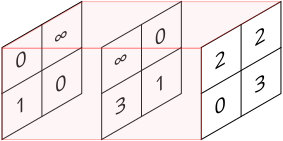
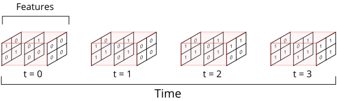

Introduction
=============

SpykeTorch is a Pytorch-based simulator of convolutional spiking neural networks (SNNs),
in which the neurons emit at most one spike per stimulus.
Computations with single-spike neurons can be efficiently reduced to multiple tensor operations.
Thanks to the versatile Pytorch library, SpykeTorch is fast in tensor operations and easily executable on GPUs by adding a few lines of code.

SpykeTorch's modules are inherited from and compatible with Pytorch's modules.
However, since the simulation of SNNs needs the concept of time, their input and output tensors include a new dimension called "time".
You may not need to think about this new dimensionality while you are using SpykeTorch.
But, in order to combine it with other Pytorch functionalities or extracting different kinds of information from SNNs,
it is important to have a good grasp of how SpykeTorch deals with time dimension.

To illustrate the concept of time, assume that there are three 2x2 grids of neurons (three different feature maps, 12 neurons in total)
that are going to represent each stimulus.
Also assume that each stimulus is presented in at most 4 time steps.
Let's consider a particular stimulus for which the spike times of these 12 neurons are:

where ∞ stands for no spike. The corresponding spike-wave tensor for this stimulus will be in the following structure:

As shown in the figure, if a neuron emits spike at time step :math:`t`, the corresponding position in spike-wave tensor will be set to
:math:`1` from time step :math:`t` to the final time step. This way of keeping the spike data helps us to compute the 
potentials of all the neurons in all of the time steps in a signle call of convolution function and results in a huge performance improvement.
Accordingly, the information about potentials over different time steps will be kept in 4-dimensional tensors. Note that in SpykeTorch's modules and 
functionalities such as :attr:`Convolution` or :attr:`Pooling`, the mini-batch dimension is sacrificed for the time dimension. Therefore, we do not
provide built-in batch processing at the moment.
